# Neural_Network_Charity_Analysis

## Overview of the Project

The purpose of this analysis was to employ deep learning models to aid a fictitious company named AlphabetSoup, a philanthropic organization dedicated to donating funds to organizations whose goals it deemed worthwhile, in vetting donation applicants.  By training a deep learning model on a retrospective dataset of about 30,000 historical donations for both successful and unsuccessful outcomes, the model served as a binary classifier to predict whether applicants would be successful if given funding.  In short, this would help AlphabetSoup know where to place their money.

## Resources:

Software: 

-	Jupyter Notebook
-	Visual Studio Code 1.49.2
-	Tensorflow
-	scikit-learn
-	pandas

## Results:

### Processing
The data was inspected and initial analysis was conducted for the observations prior to the network being built. We first dropped unnecessary columns which were deemed not relevant for predicting success.
The target variable we used for this model was the "IS_SUCCESSFUL" column.
The following feature variables were used:
-	ASK_AMT—Funding amount requested
-	APPLICATION_TYPE—Alphabet Soup application type 
-	AFFILIATION—Affiliated sector of industry 
-	CLASSIFICATION—Government organization classification  
-	INCOME_AMT—Income classification  
-	ORGANIZATION—Organization type  
-	SPECIAL_CONSIDERATIONS—Special consideration for application  
-	STATUS—Active status 
-	USE_CASE—Use case for funding  
    
  
    These columns were converted later to other variables to convert them to a numerical format. Input features count was much higher than the list above but the values were taken from these columns.

The unique value count for each column was calculated via the nunique() method found in pandas. We were able to visualize columns this way that had more than 10 unique values. We then bucketed these into the “other” column to reduce dummy columns. 
    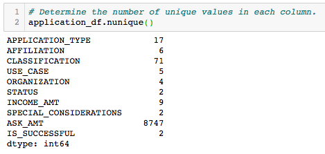
Value counts were determined to move infrequent values into the other category. "APPLICATION_TYPE" is shown below.
    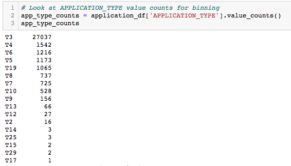
The values from the columns that occurred infrequently were filtered down to a list for value counts. We used a for loop to combine with the replace method which allowed us to replace all of the captured values into the other column. 
    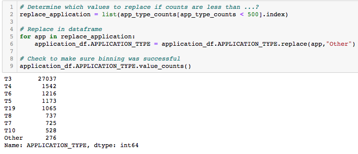
We then created a list containing string objects and one hot encoder was used to create dummy variables. This changed everything into a numerical format.
    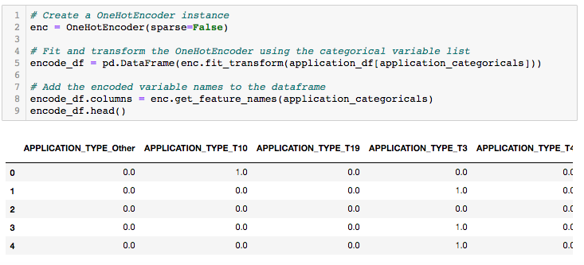
The dataset was then separated into x and y values as well as training and testing sets. The data feature was then altered a mean of zero and a one standard deviation. 
    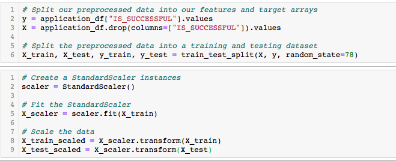

### Compiling, Training, and Evaluating the Model
The initial model was created using the Keras Neural Network Library.

The neural network input contained 43 features and one neuron for the output. The first layer contained 80 neurons and the second hidden layer had 30 layers. Both had the relu activation function and the final layer output was the sigmoid function which allowed us to classify the result as either a zero or a one.
    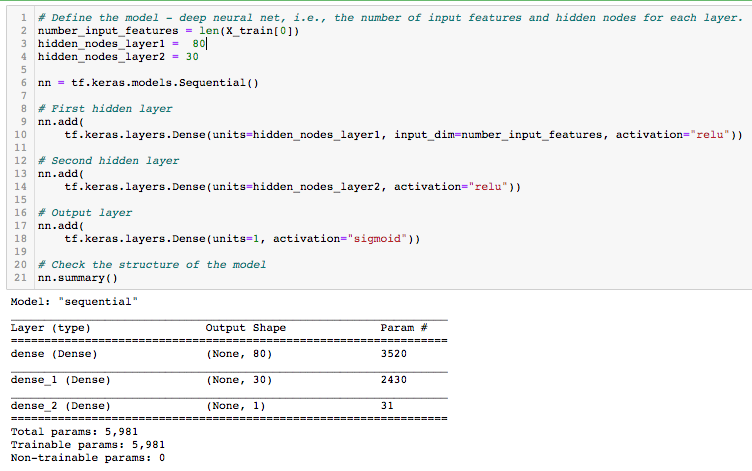
Per an evaluation this resulted in a loss of approximately 55% and an accuracy of 72.6%. 
    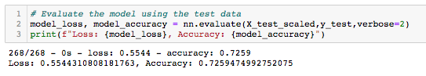

### Optimization

Adjustments were made to improve performance above 75%. 

We dropped an extra feature in the hopes of improving performance. "SPECIAL_CONSIDERATION" was selected but it did not change the results in a significant manner.
    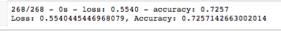
The second attempt we added more neurons to both layers which gave us a total of 100 and 50 neurons. This did not provide a significant difference.  
    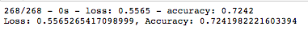
The third attempt we added another hidden layer. This did not provide us with our goal of above 75%.
    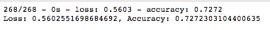
We also attempted to change the activation function on all three layers to tang but this did not solve the issue.
    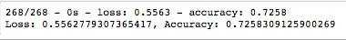

## Summary
We were unable to reach over 75% accuracy with the methods explained above. It is possible that additional optimization techniques for this model can be used. We tried using an ensemble-based random forest classifier to test this theory.
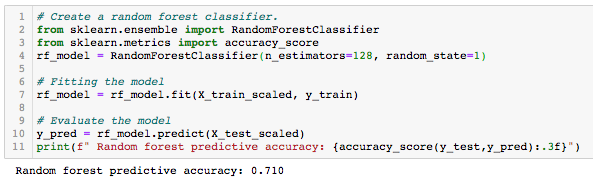

Unfortunately, the initial result was similar but there are multiple optimizations that could be attempted to increase the accuracy of the model. It is important to note that no one technique can be used for all situations, and it would be wise to keep all options available to achieve the best results.

